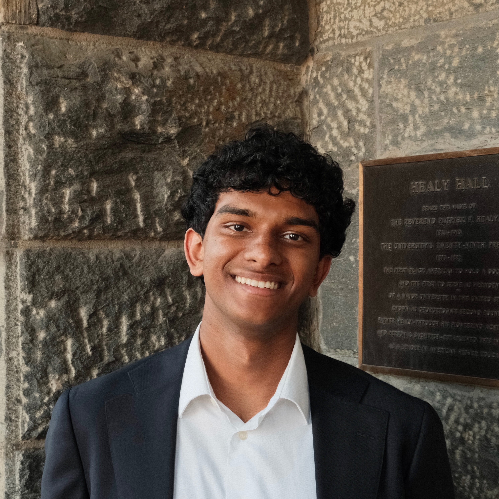

::: {.bio}

::: {.bio-photo}

:::

::: {.bio-text}

# Aadhav Rajesh

I'm an undergraduate at Georgetown University studying political economy. I'm interested in the political economy of development and the economics of tokenization
and AI access.

This summer, I was a field research intern for [gui2de](https://gui2de.georgetown.edu) and the [What Works Hub for Global Education](https://www.wwhge.org/what-we-do/tanzania) in Dar es Salaam, Tanzania,
embedded at the Tanzania Institute of Education. I'm also a Research Assistant for Professor Shareen Joshi, currently co-authoring and preparing a manuscript for journal submission.

In my free time, I like to [apply econometrics to forecast surf](https://github.com/aadhavr/campus-point-waves) and [play guitar with my friends](https://www.instagram.com/20somethingmusic/?__d=1%25252F).

::: {.bio-links}
[Email](mailto:ar2201@georgetown.edu) · [GitHub](https://github.com/aadhavr) · [CV](cv.pdf) · [Writing](writing.qmd) · [Spotify](https://open.spotify.com/user/aadhav_r?si=65869ba9eb5047be)
:::

:::

:::
