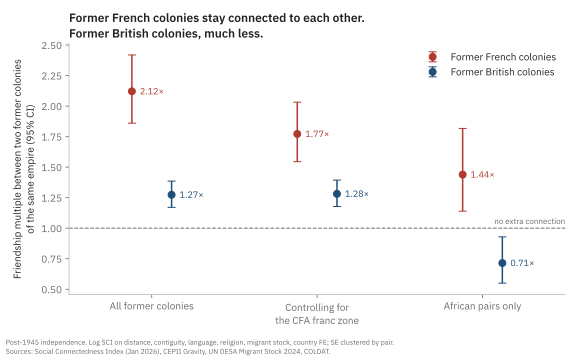

Earlier this year, I stumbled on a very cool dataset called the Social Connectedness Index (SCI) from January 2026, which measures the probability that two Facebook users in two countries are friends, for 177 countries and 15,576 country pairs. I combine it with CEPII's gravity dataset for distance, borders, language and religion; the UN's 2024 bilateral migrant stocks; and COLDAT, a dataset of which European empire ruled where, and until when.[^2]

Go ahead and look at Senegal in @fig-friends.

::: {#fig-friends}
<iframe src="figs/1_friend_picker.html" width="100%" height="600" style="border:none;"></iframe>

Friendship ties relative to prediction. Click any country.[^1]
:::

Countries that are close together, share a border, share a language or share a religion tend to have more friendships between them. I fit a model across the 14,535 country pairs (171 countries) with complete data on these factors, and use them to predict how connected any two countries should be.

The model also accounts for each country's overall level of Facebook use, so a country does not look well connected just because many of its people are online. A value of 1 means a pair is exactly as connected as those factors predict. A value of 3 means three times as connected; 0.5 means half.

You'll notice that France lights up when you click on Senegal: Senegalese Facebook users are about three times as connected to France as distance, language and religion predict. So does much of the old map of French West Africa. Mauritania sits at 3.4 times the predicted level, Côte d'Ivoire and Guinea at about 2.4, Mali at 1.6.

You may also see that one neighbor stays brown: The Gambia, a former British colony almost entirely surrounded by Senegal, sits at 0.4: less than half of what the model predicts for two countries that share a long border and a religion.

Now click on Ghana. Britain lights up too, at 1.5 times. But the rest of what was once British West Africa does not. Sierra Leone sits at 0.5. Nigeria, the other large English-speaking economy in the region, sits at 0.2: less than a fifth of the predicted level.

Britain and France ruled West Africa for roughly the same period, left it within a few years of each other, and both left behind their language. Why would one empire leave a web of connections between its former colonies and the other leave almost none?

The answer, I will argue, lies in how the two empires were run. France governed most of its West African colonies as a single federation, with one capital in Dakar, one administration and shared elite schools, and after independence most of them kept a shared currency. Britain governed Nigeria, the Gold Coast, Sierra Leone and the Gambia as four separate colonies, and each of them left the shared currency at or soon after independence. Sixty years later, the friendship data still reflects the difference in colonial administration and monetary policy.

## What we expected to see

::: {#fig-empires}
<iframe src="figs/2_empires.html" width="100%" height="600" style="border:none;"></iframe>

Last European colonizer.
:::

A former colony and its former colonizer are much more connected than their distance, language and religion predict: about 3.8 times more. Some of that is simply people who moved. Once I hold the migrant population between the two countries constant, the tie is still **2.2 times** the predicted level. Migration explains only about 40% of it, and most of the colonial tie is not from a diaspora.

And that tie is not fading. The average colonial link in the data ended 106 years ago, and the links ended across more than two centuries, which makes me wonder whether older links are weaker. They are not, at least not measurably.

The estimate is a 2% decline per decade, and the data rule out anything faster than about 5% per decade. At the point estimate, a colonial tie would take about four centuries to disappear.

That is a sharp contrast with trade. Head, Mayer and Ries (2010) show that trade between former colonies and their colonizers declines substantially in the decades after independence.[^hmr] 

## Paris and London, about the same

The obvious next question is which empire left the stronger tie to its capital, for which the point estimates favor France.

Former French colonies are about 2.5 times as connected to France as predicted, and former British colonies about 1.8 times as connected to Britain. But the difference is not statistically significant (p = 0.21). The data is consistent with the two empires being identical, and also with France being more than twice as strong. There are only 29 French and 58 British colonial links, which is not enough to rank them.

So on this question, both imperial capitals kept their colonies close, and we cannot say which kept them closer.

## Where they part

Take every pair of former colonies of the same empire that became independent after 1945. Two former French colonies are **2.1 times** as connected as predicted. Two former British colonies are **1.3 times** as connected. The gap is a factor of 1.7, and it is very precisely estimated (p < 0.001).

::: {#fig-network}
<iframe src="figs/3_sibling_network.html" width="100%" height="600" style="border:none;"></iframe>

Links between sibling colonies that beat the prediction.
:::

Now, of course francophone Africa is connected, because, after all, they share a language. But language is already in the prediction. The comparison is between two former French colonies that share French and two former British colonies that share English. Both groups get credit for their common language, but only one of them is more connected than that baseline prediction level.

::: {#fig-hub}
<iframe src="figs/hub_spoke_scatter.html" width="100%" height="620" style="border:none;"></iframe>

Each colony's ties to its capital and to its siblings.
:::

@fig-hub plots two of these ties for each former colony: to its old capital, and to the other colonies of the same empire. Hover over a colony to see the third, its tie to the other empire's colonies.

A French colony's tie to its siblings is well above its tie to the British side, while a British colony's tie to its siblings is barely different from its tie to the French side. In other words, the French empire left a web, while the British empire left spokes connected to a hub.

## Looking for a historical explanation

I argue that there are two historical explanations for this difference in social connectivity. The first is administration. French West Africa was governed from Dakar until it broke into eight states at independence; French Equatorial Africa was governed the same way from Brazzaville, and broke into four.[^3] Administrators, teachers, soldiers, and students moved between territories inside a single system. The École William Ponty, a federal school in Senegal, trained teachers, doctors and administrators from across the federation, and by Tony Chafer's count, 11 of the 16 African deputies from French West Africa in the French National Assembly were Ponty graduates.[^4] A generation of leaders who would run eight different countries had been classmates. In contrast, Britain ran Nigeria, the Gold Coast, Sierra Leone and the Gambia as separate colonies, each with its own governor, budget and capital.

The second is money, and here the history has a twist. It is tempting to say that French colonies are connected because most of them still share a currency, the CFA franc. The model can test that: add an indicator for two countries that both use the CFA franc. It matters a lot.

Britain also gave its West African colonies a common currency. From 1912, the West African Currency Board issued a single currency for the Gambia, Sierra Leone, the Gold Coast and Nigeria.[^5] At independence, every one of them left it: Ghana in 1958, Nigeria in 1959, Sierra Leone in 1964, the Gambia in 1965. Most French colonies stayed in theirs (Guinea left in 1960, but the union survived) and it still exists.[^6]

So the currency union is not a confounder to be removed from the French effect. Rather, it is part of what the French empire left behind, and part of what the British colonies chose to not take with them moving forward. The CFA control considers how much more connected any two CFA members are (two CFA members are 2.4 times as connected as otherwise similar pairs) and only the connection left over after that counts toward the French empire. But Senegal and Mali share the CFA franc because they were both French colonies. The currency is part of the empire's legacy, so this setup hands some of the empire's effect to the currency.

Despite whatever the currency explains, two former French colonies are still 1.8 times as connected as predicted, against 1.3 times for two former British colonies. So the two estimates bracket the French effect. The 2.1 connectivity measure from before counts all of the currency's effect as imperial legacy, while the 1.8 measure counts none of it. The truth is likely somewhere in between, and on either count the French colonies are more connected than the British ones.

The other obvious objection is geography. French colonies are concentrated in Africa, while British colonies are spread across Africa, Asia, the Caribbean and the Pacific. Perhaps, the French premium is really an African premium? Restricting the comparison to African pairs does the opposite of what that objection predicts: the gap between the empires gets larger, a factor of 2.0.

{#fig-gap width=100%}

In the Africa-only comparison, two former British colonies in Africa are about 0.7 times as connected as predicted, and the gap is statistically significant. Shared English is already in the prediction, so among African states that speak English, a British past goes with about 30% fewer ties than their common language alone would predict.

I can't separate federation from currency from the institutions that came after independence. They are bundled together in the history and in the data. However, I am arguing that the two empires left measurably different social structures, and the difference is reflected in the histories of how these empires were run differently.

## Closing thoughts on these networks

Why should anyone care about Facebook friendships? Because the Social Connectedness Index predicts trade, investment, migration and the spread of information (Bailey et al. 2018).[^bailey] A dense social network is the infrastructure through which a trader in Dakar finds a buyer in Abidjan, and how news, jobs and prices move between them.

By that measure, the French empire left its colonies a regional network that still carries weight sixty years later, while the British empire left a set of separate lines to London.

Facebook users are not a random sample of anyone. This is one snapshot, so the "not fading" result compares old and recent colonial links rather than following any link over time. And any dataset of empires involves judgment calls about who ruled a territory last; mine are listed below.[^7]

## Appendix

For anyone who wants to check the numbers, @tbl-results reports the models behind every estimate in this post. The text reports each coefficient *b* as a multiple, exp(*b*): the 0.752 for French siblings in column 3, for example, is the 2.1 times above.

::: {#tbl-results .column-page}


Regression results.
:::

::: {.small}
The outcome is the log of the scaled SCI, so coefficients are in log points and exp(*b*) gives the multiples in the text. Every column includes a fixed effect for each country on both sides of the pair, which absorbs population, Facebook use and anything else about a single country. Each country pair appears twice, once in each direction, so standard errors are clustered by country pair. Siblings are two former colonies of the same empire that both became independent after 1945. Column 5 has no colonial-link terms because no colonizer is in the African sample; terms that do not occur in a sample are dropped. In column 6, decades since the colonial link ended are centered at the sample mean of 106 years. The France-Britain rows give the difference between the two coefficients, its standard error from the full covariance matrix, and its p-value. Using COLDAT's mean dates, or dropping the weakest 5% of connections, leaves the estimates essentially unchanged. \* p < 0.1, \*\* p < 0.05, \*\*\* p < 0.01.
:::

[^1]: The predicted value comes from a gravity regression of log SCI on log distance, a shared border, shared official and spoken languages, and shared religion, with a fixed effect for each country. The fixed effects absorb anything about a single country, including how many people use Facebook. The maps show actual relative to predicted. They do not account for migration, so they show the full colonial pattern. The estimates in the text also hold bilateral migrant stocks constant, so map values and text values differ slightly.

[^2]: Sources: Social Connectedness Index, January 2026 release (Johnston, Kuchler, Kulkarni and Stroebel 2026, *Data in Brief*); CEPII Gravity database V202211; UN DESA International Migrant Stock 2024; COLDAT (Becker 2019). Kosovo is dropped because it is not in the CEPII data. Six further countries drop out of the regressions because they are missing one or more of the CEPII control variables. Coding decisions: each former colony is assigned to its last European colonizer, with four exceptions where that rule picks a brief or partial administration — Morocco and Cameroon to France, Eritrea and Libya to Italy. Vanuatu, an Anglo-French condominium, has no single colonizer and is left out of the sibling comparison. The United States, Canada, Australia and New Zealand are treated as settler colonies and kept separate; South Africa is treated as a regular colony.

[^3]: Frederick Cooper, *Citizenship between Empire and Nation: Remaking France and French Africa, 1945–1960* (Princeton University Press, 2014). Cooper's central argument is that the break-up of French West Africa into eight states was not inevitable; federation was a live option until the end.

[^4]: Tony Chafer, "Education and Political Socialisation of a National-Colonial Political Elite in French West Africa, 1936–47," *Journal of Imperial and Commonwealth History* 35, no. 3 (2007): 437–458. On the school itself, see Peggy R. Sabatier, "'Elite' Education in French West Africa: The Era of Limits, 1903–1945," *International Journal of African Historical Studies* 11, no. 2 (1978): 247–266.

[^5]: A. G. Hopkins, "The Creation of a Colonial Monetary System: The Origins of the West African Currency Board," *African Historical Studies* 3, no. 1 (1970): 101–132. Exit dates are from the successor central banks.

[^6]: Fanny Pigeaud and Ndongo Samba Sylla, *Africa's Last Colonial Currency: The CFA Franc Story* (Pluto Press, 2021).

[^7]: Robustness: the results are unchanged to two decimal places using COLDAT's mean dates instead of its latest dates, and unchanged when the weakest 5% of connections are dropped. The migrant-stock data report zeros for many country pairs where the true value is unknown, so the migration control is a lower bound on the diaspora. Code and replication: <https://github.com/aadhavr/sci-colonial>.

[^hmr]: Keith Head, Thierry Mayer and John Ries, "The Erosion of Colonial Trade Linkages after Independence," *Journal of International Economics* 81, no. 1 (2010): 1–14.

[^bailey]: Michael Bailey, Rachel Cao, Theresa Kuchler, Johannes Stroebel and Arlene Wong, "Social Connectedness: Measurement, Determinants, and Effects," *Journal of Economic Perspectives* 32, no. 3 (2018): 259–280.
