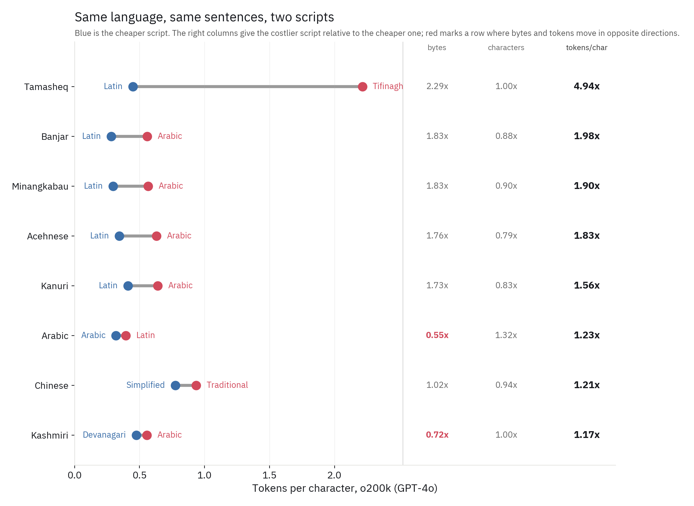
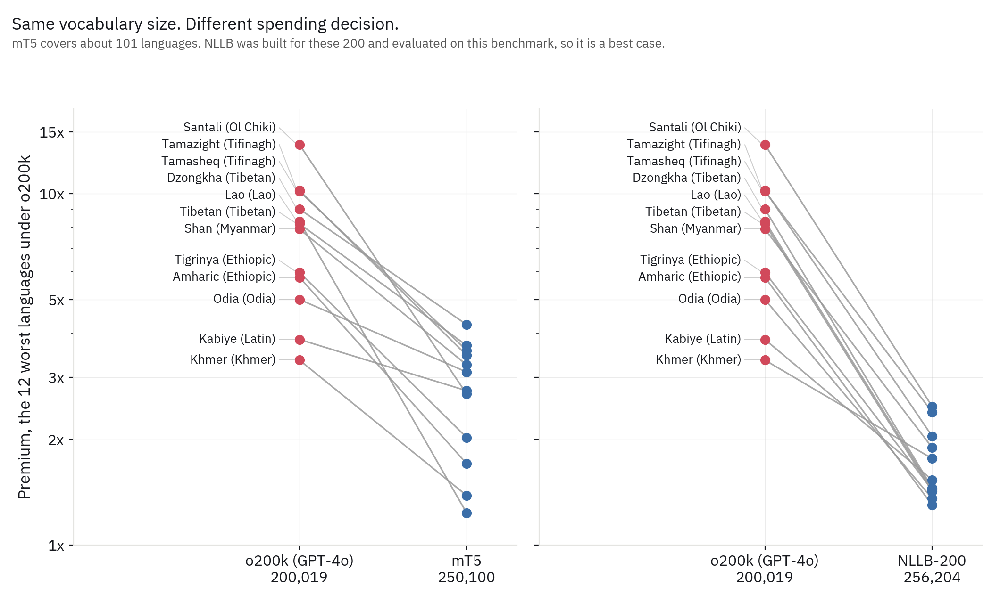

```{python}
#| label: setup
#| include: false

import numpy as np
import pandas as pd
import plotly.graph_objects as go

INK, MUTED, RULE = "#16181D", "#6B7079", "#E4E4E1"
BLUE, RED = "#3B6EA8", "#D1495B"
FONT = "IBM Plex Sans, -apple-system, sans-serif"

ORDER = ["gpt2", "cl100k", "qwen2.5", "o200k", "mt5", "nllb"]
LABELS = {"gpt2": ("GPT-2", 50_257), "cl100k": ("cl100k (GPT-3.5/4)", 100_277),
          "qwen2.5": ("Qwen2.5", 151_643), "o200k": ("o200k (GPT-4o)", 200_019),
          "mt5": ("mT5", 250_100), "nllb": ("NLLB-200", 256_204)}

OVERRIDES = {"taq": "Tamasheq", "tzm": "Tamazight", "sat": "Santali",
             "knc": "Kanuri", "bjn": "Banjar", "min": "Minangkabau",
             "ace": "Acehnese", "kbp": "Kabiye", "nus": "Nuer",
             "dzo": "Dzongkha", "shn": "Shan", "bod": "Tibetan",
             "ory": "Odia", "arb": "Arabic", "zho": "Chinese",
             "lao": "Lao", "khm": "Khmer", "mya": "Burmese",
             "amh": "Amharic", "tir": "Tigrinya", "kas": "Kashmiri"}
SCRIPTS = {"Latn": "Latin", "Arab": "Arabic", "Tfng": "Tifinagh",
           "Olck": "Ol Chiki", "Tibt": "Tibetan", "Mymr": "Myanmar",
           "Ethi": "Ethiopic", "Orya": "Odia", "Khmr": "Khmer",
           "Laoo": "Lao", "Deva": "Devanagari", "Hans": "Simplified",
           "Hant": "Traditional", "Cyrl": "Cyrillic", "Geor": "Georgian"}

def pretty(code):
    iso, _, scr = code.partition("_")
    base = OVERRIDES.get(iso)
    if base is None:
        try:
            import langcodes
            base = langcodes.Language.get(iso).display_name()
            if base.lower() == iso:
                base = iso
        except Exception:
            base = iso
    return f"{base} ({SCRIPTS.get(scr, scr)})"

df = pd.read_csv("premiums.csv")
df = df[df.lang_code != "eng_Latn"].copy()
df["name"] = df.lang_code.map(pretty)

def style(fig, height, xtitle=None, ytitle=None):
    fig.update_layout(
        height=height, autosize=True,
        margin=dict(l=10, r=10, t=14, b=54),
        font=dict(family=FONT, size=14, color=INK),
        paper_bgcolor="rgba(0,0,0,0)", plot_bgcolor="rgba(0,0,0,0)",
        hoverlabel=dict(bgcolor="white", bordercolor=RULE,
                        font=dict(family=FONT, size=13, color=INK)),
        showlegend=False, dragmode=False)
    fig.update_xaxes(title=xtitle, title_font_size=13, showgrid=True,
                     gridcolor=RULE, gridwidth=0.5, zeroline=False,
                     linecolor=RULE, ticks="outside", tickcolor=RULE,
                     tickfont_size=12)
    fig.update_yaxes(title=ytitle, title_font_size=13, showgrid=False,
                     zeroline=False, linecolor=RULE, tickfont_size=12)
    return fig

CONFIG = {"displayModeBar": False, "responsive": True, "scrollZoom": False}
TICKS = [1, 1.5, 2, 3, 5, 10, 20]
```

Suppose you are a Malian programmer, using an LLM to help you write code:
the same prompt in Tamasheq, your language, written in a Latin script vs. a
Tifinagh will have the same number of characters, yet the Tifinagh script
will cost you 5x more tokens. Tifinagh is the traditional writing system
used to write the Berber languages of North and West Africa. You quickly
rule out the obvious explanations: after all, both prompts are the same
length, the content is the same, and one is a Latin transliteration of the
other, so they're the same language. What is left is the tokenizer and the
token cost turns out, not to be a property of your script or your language,
but of them as a pair. You realize that there wasn't much text in that
language-script combination in the corpus your tokenizer was trained on.

The Arabic script, to use another case that makes this point, is cheaper
than the romanized alternative for Arabic speakers. Yet, if you're an
Indonesian who speaks Acehnese, an Austronesian language of northern
Sumatra unrelated to Arabic, which uses an Arabic-based script, you may
spend nearly twice the token cost compared to an Arabic speaker, despite
using the same Arabic script.

This is economically significant beyond the literary implications of it
because tokens have become the de facto currency of AI. Commercial LLMs use
tokens to price their APIs, and retail-facing AI apps use tokens to measure
context limits. In both cases, tokenization drives a wedge between nominal
metrics and real consumption. For pay-as-you-go developers, variations in
token cost based on language/script force non-English queries to pay higher
real marginal costs for identical computational work. For flat-fee retail
subscribers, the same inefficiency acts as a non-price rationing, where
communicating in a non-English language quietly shrinks your working memory
and exhausts LLM capacity earlier. So if you have 200,000 tokens for an LLM,
what you can do and how long you can work with your LLM vary based on your
language and script. A developer pays 5x for the same request and a
subscriber's 200,000-token window is worth about 20,000 tokens because they
speak Tamasheq and write in their traditional script.

The data used below comes from FLORES-200, a dataset of 1,012 sentences,
professionally translated and aligned across 203 language-script pairs, so
semantic content is fixed in how it is constructed. I then tokenized all of
it under six production tokenizers and measured each language against an
English control-sentence. Unless noted, the figures use o200k, the tokenizer
behind GPT-4o.

## The same language costs more in one script than the other

{#fig-scripts}

Tamasheq is the cleanest case because both versions of the language are the
same text, with nearly identical character counts (0.996 by ratio), yet the
Tifinagh version costs 4.94 times as many tokens per character. Since we are
considering tokens per character, length is removed from our comparison
entirely.

The next obvious objection is encoding: non-Latin scripts need more bytes
per character in UTF-8, so perhaps tokens are just tracking bytes. The
counterexample to this is how Kashmiri in Devanagari script costs 2.51 bytes
per character and 0.475 tokens per character, while in Arabic script, 1.81
bytes and 0.555 tokens. The Devanagari script uses 39% more bytes yet expends
14% fewer tokens per character. So byte width does not explain variation in
token cost.

The Malay family gives four independent replications, and they complicate
things further:

| Language | Latin (tok/char) | Arabic (tok/char) | Latin (byte/char) | Arabic (byte/char) | Chars (Arab ÷ Latn) | Bytes (Arab ÷ Latn) | Tokens/char (Arab ÷ Latn) |
|---|---|---|---|---|---|---|---|
| Banjar | 0.282 | 0.558 | 1.002 | 1.828 | 0.89x | 1.83x | 1.98x |
| Minangkabau | 0.297 | 0.565 | 1.001 | 1.831 | 0.90x | 1.83x | 1.90x |
| Acehnese | 0.344 | 0.630 | 1.018 | 1.791 | 0.79x | 1.76x | 1.83x |
| Kanuri | 0.411 | 0.640 | 1.055 | 1.822 | 0.84x | 1.73x | 1.56x |

Each Malay language in the Arabic script uses fewer characters (probably
because of the Arabic script's abjad system, where vowels are dropped), yet
costs roughly twice the tokens per character. Again, noting that Acehnese
and the other Malay languages use the Arabic script but are not
linguistically related to Arabic.

However for Arabic, the Arabic script is the cheap option with 0.319 tokens
per character, compared to 0.393 for Arabizi, the romanized form that uses
digits for consonants. Arabizi can be written entirely with ASCII, one byte
per character, the cheapest possible encoding and still costs 23% more per
character. Arabic script is cheap for Arabic and nearly twice the cost for
Acehnese, an Austronesian language of northern Sumatra with no relation to
Arabic beyond a shared writing system.

Byte-pair encoding (BPE) merges over strings, not over scripts. The
Arabic-script tokens in o200k are Arabic words, and a merge that learned a
common Arabic word does nothing for an Acehnese word that happens to use the
same letters. For Acehnese the tokenizer falls back toward character-level
segmentation, and the cost roughly doubles. So, what tokenizers are pricing
is the language-script pair determined by how much of that pair exists in
the training corpus.

## The median language isn't the problem

If we take a step back from language-script pairs to the full distribution,
a different trend emerges. Under o200k the median non-English language costs
1.74x English. Unfortunately for Santali speakers who write in Ol Chiki,
they can expect to spend 13.79x in tokens, the worst case for o200k. Under
GPT-2 the median is 2.55x and the worst, Shan, is 18.70x.

```{python}
#| label: fig-distribution

rows = [t for t in ORDER if (df.tokenizer == t).any()]
rng = np.random.default_rng(0)
fig = go.Figure()

for i, tk in enumerate(reversed(rows)):
    g = df[df.tokenizer == tk]
    fig.add_trace(go.Scatter(
        x=g.median_premium, y=i + rng.uniform(-0.17, 0.17, len(g)),
        mode="markers", marker=dict(size=7, color=BLUE, opacity=0.45),
        customdata=np.stack([g.name, g.tokens_per_char], axis=-1),
        hovertemplate=("<b>%{customdata[0]}</b><br>%{x:.2f}x English<br>"
                       "%{customdata[1]:.2f} tokens per character"
                       "<extra></extra>")))
    med = g.median_premium.median()
    fig.add_shape(type="line", x0=med, x1=med, y0=i - 0.34, y1=i + 0.34,
                  line=dict(color=INK, width=2.5))
    w = g.nlargest(1, "median_premium").iloc[0]
    fig.add_trace(go.Scatter(
        x=[w.median_premium], y=[i], mode="markers+text",
        marker=dict(size=10, color=RED), text=[f"  {w['name']}"],
        textposition="middle right", textfont=dict(size=12, color=RED),
        hoverinfo="skip"))

fig.update_xaxes(type="log", tickvals=TICKS,
                 ticktext=[f"{t:g}x" for t in TICKS],
                 range=[np.log10(0.85), np.log10(34)])
fig.update_yaxes(tickvals=list(range(len(rows))),
                 ticktext=[f"{LABELS[t][0]}<br><span style='font-size:11px;"
                           f"color:{MUTED}'>{LABELS[t][1]:,}</span>"
                           for t in reversed(rows)])
style(fig, 430, "Tokens needed, relative to the same sentence in English")
fig.show(config=CONFIG)
```

@fig-distribution puts every language on the axis as a single dot, with a
row for each tokenizer. Two things are visible immediately. Each row has a
dense cluster, a floor that nearly every language pays, and then some
stragglers out to the right. The floor sits around 1.3x for NLLB and around
2.2x for GPT-2.

```{python}
#| label: fig-cumulative

fig = go.Figure()
palette = ["#3B6EA8", "#D1495B", "#7C9C3E", "#8E6BA8", "#C98A3E", "#4A8C8C"]

for tk, col in zip(ORDER, palette):
    g = df[df.tokenizer == tk]
    if g.empty:
        continue
    gs = g.sort_values("median_premium")
    v = gs.median_premium.values
    y = np.arange(1, len(v) + 1) / len(v) * 100
    over = float((v > 3).mean()) * 100
    fig.add_trace(go.Scatter(
        x=v, y=y, mode="lines", line=dict(color=col, width=2.4),
        customdata=np.stack([gs.name, [LABELS[tk][0]] * len(v)], axis=-1),
        hovertemplate=("<b>%{customdata[1]}</b><br>%{y:.0f}% of languages "
                       "cost at most %{x:.2f}x<br><span style='color:#6B7079'>"
                       "here: %{customdata[0]}</span><extra></extra>")))
    fig.add_annotation(x=np.log10(3.25), y=100 - over,
                       text=f"{LABELS[tk][0]} — {over:.0f}% above 3x",
                       showarrow=False, xanchor="left",
                       font=dict(size=12, color=col))

fig.add_vline(x=3, line=dict(color=MUTED, width=1, dash="dash"))
fig.update_xaxes(type="log", tickvals=TICKS,
                 ticktext=[f"{t:g}x" for t in TICKS],
                 range=[np.log10(0.85), np.log10(24)])
fig.update_yaxes(range=[0, 103], tickvals=[0, 25, 50, 75, 100],
                 ticktext=["0%", "25%", "50%", "75%", "100%"])
style(fig, 500, "Tokens needed, relative to the same sentence in English",
      "Share of languages costing at most this much")
fig.show(config=CONFIG)
```

@fig-cumulative is the same data read cumulatively. The x-axis is the token
premium, with the height of each curve being the share of that tokenizer's
languages costing at most that much. So a point at (3x, 85%) means that 85%
of this tokenizer's languages cost three times English or less.

What these graphs show is that a better tokenizer does not lower everyone's
premium proportionally. It shrinks the set of languages in the penalty tail.
Under GPT-2, 41.4% of languages cost more than 3x English. Under o200k,
7.4%. Under NLLB, 0.0%. Worth noting the trend in the other direction: under
mT5 and NLLB a handful of languages cost less than English.

The consequence a consumer feels is that a 200,000-token context window
holds about 200,000 tokens' worth of English content, 33,505 of Tigrinya,
19,691 of Tamasheq in Tifinagh, and 14,506 of Santali — a ration of
one-thirteenth of the capacity for Santali. Similarly, a developer paying
per token for an LLM's API faces a markup. Neither would see a line item in
their invoice attributing it to the script they write in.

## Doubling the vocabulary helped almost everyone

If allocation is what matters, the next step is to test what happened when a
major tokenizer reallocated. Between cl100k and o200k, OpenAI roughly
doubled the vocabulary from 100,277 tokens to 200,019. As @fig-upgrade
reflects, 200 of 203 languages got cheaper. On the scatter, nearly every
point sits below the diagonal, including most of the worst cases.

```{python}
#| label: fig-upgrade

w = df.pivot(index="lang_code", columns="tokenizer", values="median_premium")
s = w[["cl100k", "o200k"]].dropna()
s["name"] = [pretty(i) for i in s.index]
worse = s[s.o200k >= s.cl100k * 0.95]
better = s.drop(worse.index)

fig = go.Figure()
for part, col, size, op in [(better, BLUE, 7, 0.5), (worse, RED, 12, 1.0)]:
    fig.add_trace(go.Scatter(
        x=part.cl100k, y=part.o200k, mode="markers",
        marker=dict(size=size, color=col, opacity=op),
        customdata=part["name"],
        hovertemplate=("<b>%{customdata}</b><br>cl100k %{x:.2f}x → "
                       "o200k %{y:.2f}x<extra></extra>")))

for _, r in worse.iterrows():
    fig.add_annotation(x=np.log10(r.cl100k * 1.15), y=np.log10(r.o200k),
                       text=r["name"], showarrow=False, xanchor="left",
                       font=dict(size=12, color=RED))

lim = [0.85, float(s[["cl100k", "o200k"]].values.max()) * 1.5]
fig.add_shape(type="line", x0=lim[0], y0=lim[0], x1=lim[1], y1=lim[1],
              line=dict(color=INK, width=1, dash="dash"))
for ax in (fig.update_xaxes, fig.update_yaxes):
    ax(type="log", tickvals=[1, 2, 3, 5, 10, 20],
       ticktext=["1x", "2x", "3x", "5x", "10x", "20x"],
       range=[np.log10(lim[0]), np.log10(lim[1])])
style(fig, 620, "Premium under cl100k (GPT-3.5/4)",
      "Premium under o200k (GPT-4o)")
fig.show(config=CONFIG)
```

Three languages did not benefit from this: Santali went from 12.83x to
13.79x, Tamasheq went from 10.04x to 10.16x, and Tamazight went from 10.07x
to 10.21x.

Three cases out of 203 is not a pattern, but the three languages share
something: Ol Chiki and Tifinagh have almost no digital corpus. These
languages fell outside of every round of vocabulary expansion. So, if
vocabulary expansion is not neutral across languages, someone decides where
the new tokens go, and the answer follows from what is in the corpus.

## Allocation, not size

So how much of the penalty is a budget constraint, and how much is a
spending decision?

{#fig-allocation}

Let's compare tokenizers of similar size built on different corpora. NLLB
carries 256,204 tokens against o200k's 200,019. Of the twelve worst
languages under o200k, the gap is roughly fourfold. Under NLLB, the
languages with a premium between 3x and 13x under o200k are now between 1.4x
and 2.54x, with the ordering largely preserved.

NLLB is a best case; it was built for exactly these 200 languages and
evaluated on this benchmark. mT5 in contrast, covers around 101 languages,
250,100 tokens, and was not built for FLORES-200. Santali drops from 13.79x
under o200k to 2.69x and does not appear among mT5's eight worst languages,
which now tops at Dzongkha at 4.24x.

Vocabulary size is functionally a budget, and our token premium is set by
how the budget is spent. Corpus composition determines the spending.

## What would change this

The fix is known and cheap. A fourfold reduction in the worst-case penalty
was possible from a 28% larger vocabulary, and a similarly substantial one
was possible at no size increase at all, just a different corpus. This is an
allocation decision made by a small number of firms that sets a durable cost
and capability differential across populations. Given how transformative
LLMs have been and will continue to be, the cost and capability differential
could have significant effects on LLM adoption.

I did try to test whether any of this shows up in observed adoption, using
Anthropic's Economic Index, which reports Claude usage by country normalized
by working-age population. But the index covers 121 countries whose
population-weighted premiums run from 1.0x to 3.4x, with 90% below 1.7x.
Every country above 3.4x reports no usage data at all — Laos at 8.4x, Bhutan
at 7.5x, Myanmar, Eritrea.[^adoption]

The populations paying this cost are not in the rooms where the training
corpus is assembled, and they are not in the data afterward.

[^adoption]: I relate a population-weighted country premium (FLORES language
premiums weighted by CLDR writing-population shares) to the Index's
usage-per-working-age-capita measure across 121 countries. The correlation
in logs is r = −0.27, but I would not read it as an estimate of anything.
The premium varies at the script level not the country level, and 84 of 121
countries have a Latin-script dominant language. Dominant-script dummies
explain roughly half the variation in log premium, and a rough
effective-cluster count comes to about two. Also, CLDR's shares are derived
from literacy rates and overstate English use in multilingual countries, so
premiums are understated most where the penalty is largest. Ethiopia weights
in at 2.8x including English and 3.9x excluding it, against 5.8x for Amharic
alone. Separately, Anthropic publishes first-party API usage only as a global
aggregate, so the consumer-versus-API comparison that would distinguish a
price effect from a capability constraint cannot be run on public data. Code
and replication at
[github.com/aadhavr/token-premium-measurement](https://github.com/aadhavr/token-premium-measurement).
